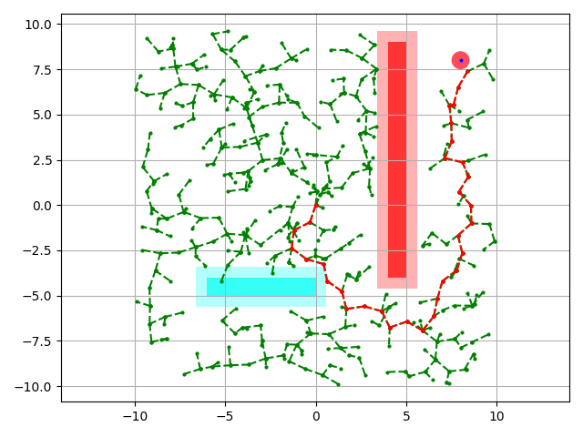
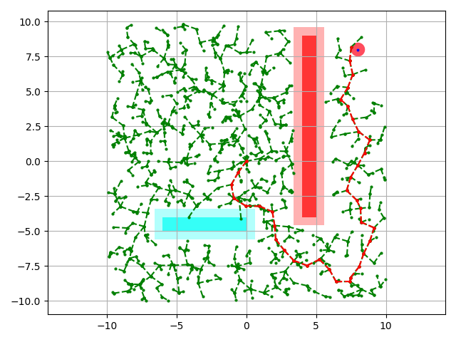
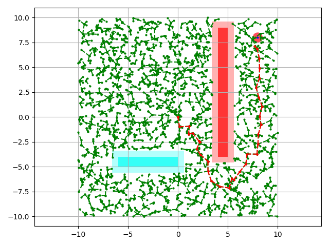
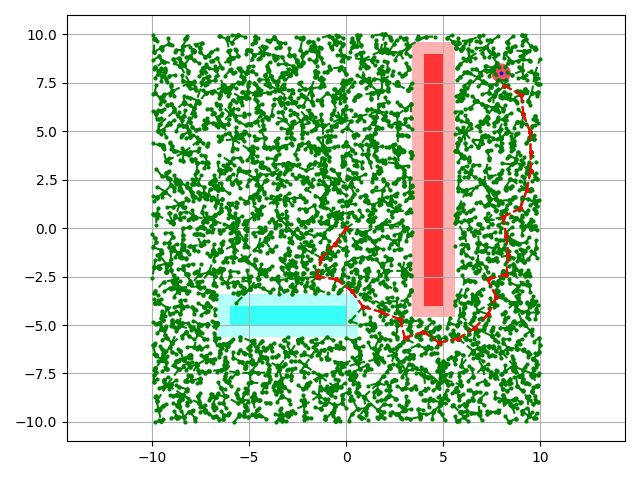
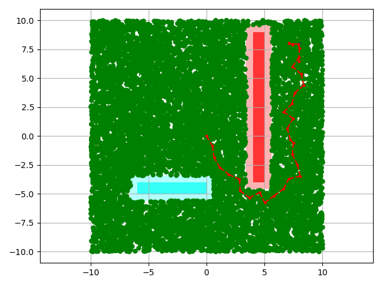

# RRT
Complete code for RRT based path search. The explanation can be found [here](https://journals.sagepub.com/doi/abs/10.1177/0278364911406761). 

The following is an implementation of RRT and RRT* for a 2-D environment. 

### Variables:
1. goal: A list of (x,y) coordinates
2. start: A list of (x,y) coordinates
3. obss: A list of lists with the (x,y) coordinates of the vertices of the obatcles. The x-coordinates must be mentioned          first.
4. N: Max number of iterations you wish to run

The code allows you to choose a starting point, and rectangular obstacles. 

